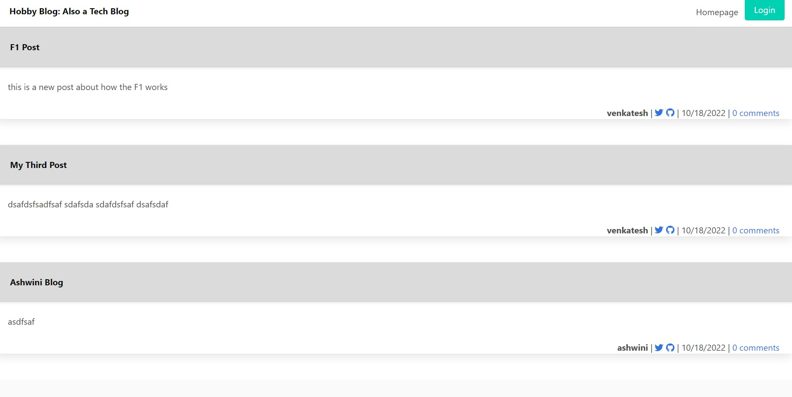

# tech-blog

Deployed URL: https://ashwini-tech-blog.herokuapp.com/

Cloned the repo.
Ran npm install at the root folder of this project
Created a .env file at the root folder of the project
Open a mysql shell and run source db/schema.sql.
Quit the mysql shell and ran npm start.
Once the server is started, accessed the app at http://localhost:3001

